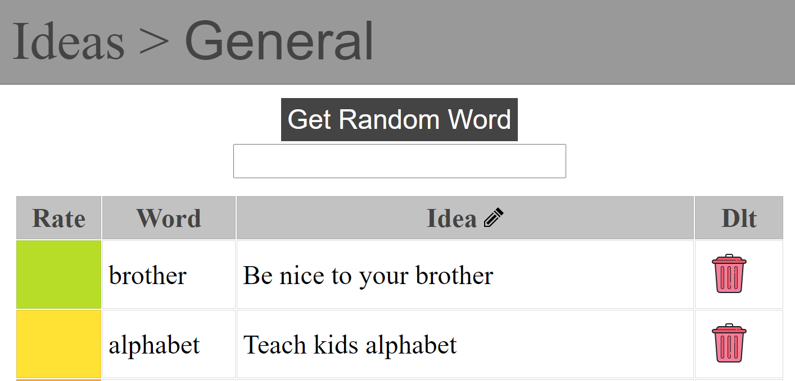
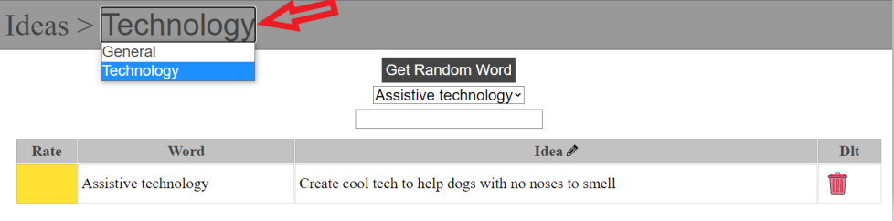
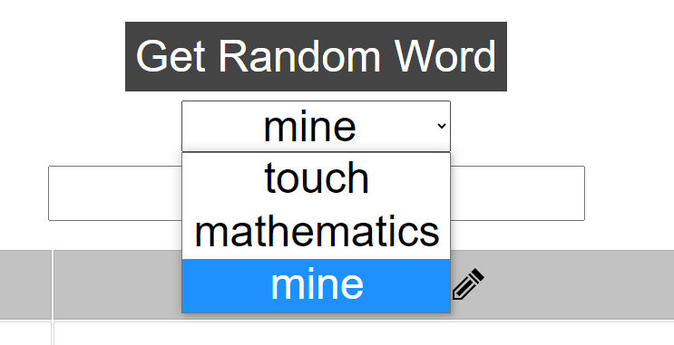
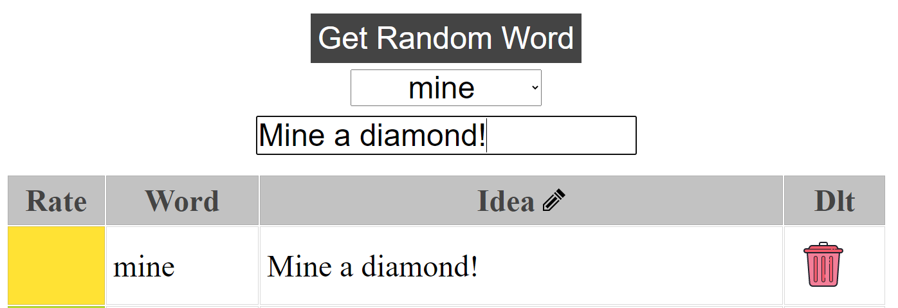
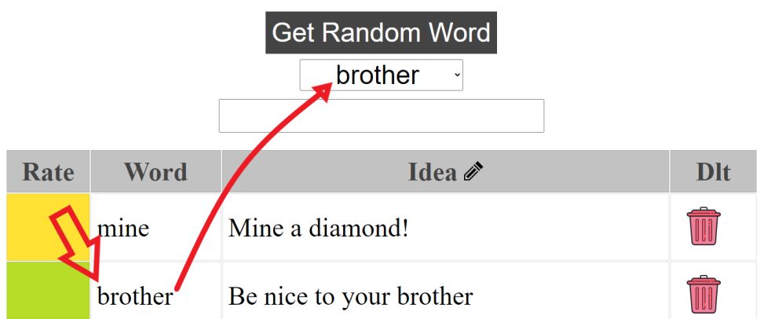
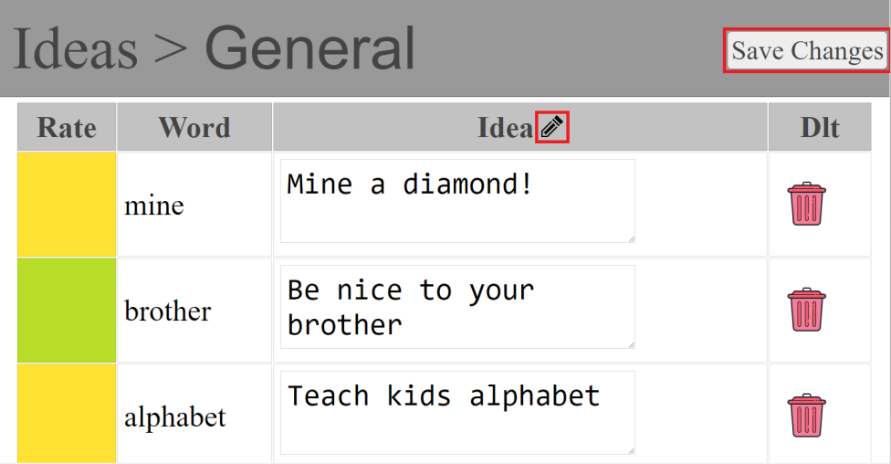
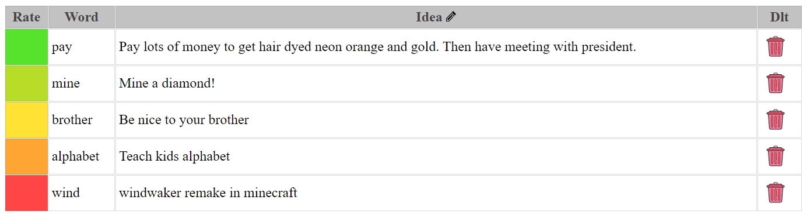

# Random Word Idea Generator
---
Some of the most creative people on the planet use random word generators as a source of inspiration. This project takes that idea to the next level by providing you with a plethora of random words and a way to store, categorize, and rate the ideas you come up with based on the word.

---
## Database driven
#### Structure

**Categories** are the top level data and **Words** and **Ideas** are linked to a **Category**. Furthermore, each **Idea** is linked to a **Word** and a **Category**

Using this simple schema allow for new **Categories**, **Words**, and **Ideas** to be added with ease. Just populate each of ORM-driven tables with the data you desire to flesh the app out to your use case.

##### Example:

If you want the app to help with ideas on new YouTube videos, you could add a YouTube category to the **Categories** tables and populate the **Words** table with words related to the types of videos you normaly make.

---
## General Functions

#### Change The Category
Change your current category by clicking the current category and changing to your desired category. 

#### Generate Random Word
Click "Get Random Word" to get a random word from the DB. Words are stored in a drop down list in case inspiration strikes a bit too late.

#### Save New Idea

Simply type your idea in the input field and hit "ENTER" or on mobile hit the "OK", "GO", etc. button.

#### Recall Previous Word

If you find yourself thinking "Oh man seeing the word **brother** in the list makes me think of a new idea! But I can't randomly get it loaded no matter how hard I try" this feature is for you.

Just click any word from the Ideas list and it will reload the word into the words dropdown.

#### **Ultimate** Editing

Editing is on 10 with this app as creative can strike at any moment. Simply hit the pencil icon in the idea column and gain the ability to edit any idea in the list inline. Once you've exhausted your creative juices just click "Save Changes" or re-click the pencil icon to save all changes made to any idea.

#### Rate Your Ideas

Let's face it, sometimes your ideas just don't make sense and sometime your ideas seem as though they were inevitable from the start! Either way it's easy to rate those ideas inside this app. Simply click the "Rate" column to change the color coded rating for the idea.

